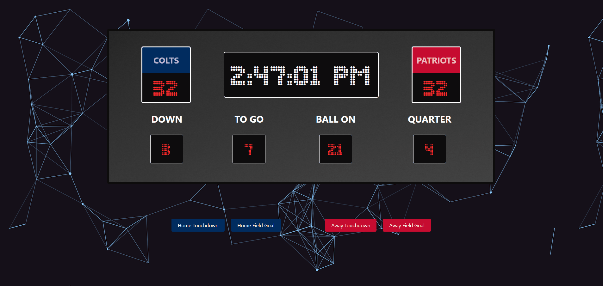

# Module Project: React Components and Components State - American Football Scoreboard

This project allows you to practice the concepts and techniques learned in this module and apply them in a concrete project. This module explored React components and component state. During the module, you studied what React is, what React components are and how to build them, what state is and how to make a component stateful, and how to change a components state with a click handler. In your project you will demonstrate proficiency of these subjects and principles by creating an application using each of these.

## Instructions

**Read these instructions carefully. Understand exactly what is expected _before_ starting this project.**

### Commits

Commit your code regularly and meaningfully. This helps both you and your team lead in case you ever need to return to old code for any number of reasons.

### Description

In this project, you build an app that diplays a scoreboard for an american football game. There will be two buttons for each team - one will increment that team's score by three points (for a "field goal") and the other will increment that team's score by seven points (for a "touchdown" and "extra point"). The css is already done for you. You should focus your efforts on the functionality of the app.

## Project Set Up

- [ ] Create a forked copy of this project.
- [ ] Add your team lead as collaborator on Github.
- [ ] Clone your OWN version of the repository in your terminal
- [ ] CD into the project base directory `cd american-football-scoreboard`
- [ ] Download project dependencies by running one of these two commands `yarn` or `npm install`
- [ ] Using the same command tool (yarn or npm) start up the app using `yarn start` or `npm start`
- [ ] Create a new branch: git checkout -b `<firstName-lastName>`.
- [ ] Implement the project on your newly created `<firstName-lastName>` branch, committing changes regularly.
- [ ] Push commits: git push origin `<firstName-lastName>`.

Follow these steps for completing your project.

- [ ] Submit a Pull-Request to merge <firstName-lastName> Branch into master (student's Repository). **Please don't merge your own pull request**
- [ ] Add your team lead as a reviewer on the pull-request
- [ ] Your team lead will count the project as complete by merging the branch back into master.
- [ ] Do your magic!

## Minimum Viable Product

1. Hold each team's current score in a state value
1. Render each team's current score that is in state to the DOM.
1. Be able to click the different buttons to increment the appropriate team's score by the correct amount

### STEP 1 & 2 - Adding Team Scores to the Component's State

- Import the `useState` hook
- Set up the state values for the Lions team score using the state hook

```js
const [value, setValue] = useState(); // Give these better names, and decide whether you want to pass an initial score into the state hook as the initialValue
```

- Set up the state value for the Tigers team score using a second state hook call

### STEP 3 - Render the Scores to the DOM

- The scores in the JSX are currently hardcoded to 32 points each. Remove the hardcoded values
- Render the state values from what we just set up in steps 1 and 2
- Play around with different initial values to test if they are rendering on the DOM correctly

### STEP 4 - Add Click Functionality to Increment the Scores

- Add the `onClick` handler to each function
- Determine how much you will need to increment the score for each button
  - A touchdown is worth 7 points (assume the following extra point is made)
  - A field goal is worth 3 points
- Inside the click handlers on each button, use the setter functions for each team to increment the appropriate team's score by the correct amount.

## Stretch Problems

After finishing your required elements, you can push your work further. These goals may or may not be things you have learned in this module but they build on the material you just studied. Time allowing, stretch your limits and see if you can deliver on the following optional goals:

- Break out parts of this component into smaller components and compose multiple components together to make the UI
- Write a "handler" function in the component that takes in a team name and an amount. This function will then be passed to each button's click handler. It will increment the correct team's score by the passed in amount
- Play around with the styling and make this project your own! Maybe make it a soccer (non-american football) scoreboard, or a rugby or baseball scoreboard
- Add a button that changes which quarter the game is in, and then render the state quarter value on the scoreboard
- Make the entire board fully functional with buttons and state! (If you want to make a timer, you'll have to look into useEffect)


Andy Dillon
